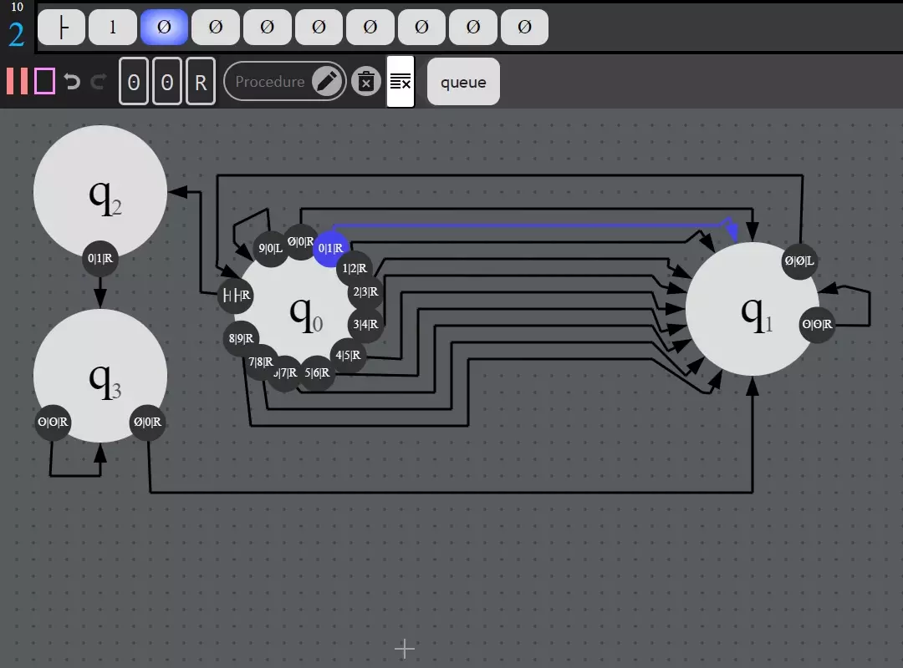
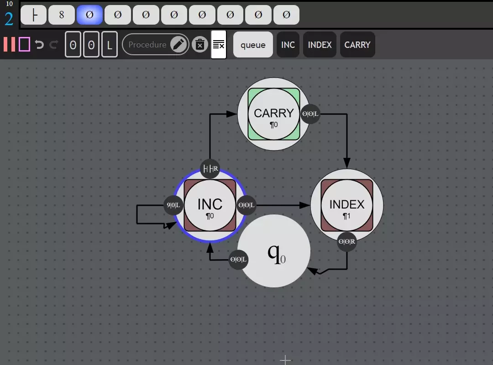
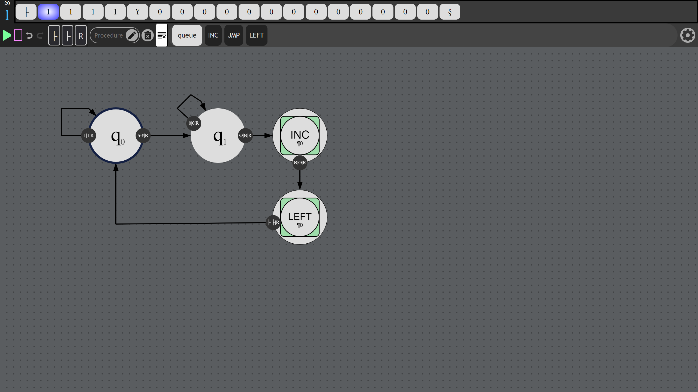
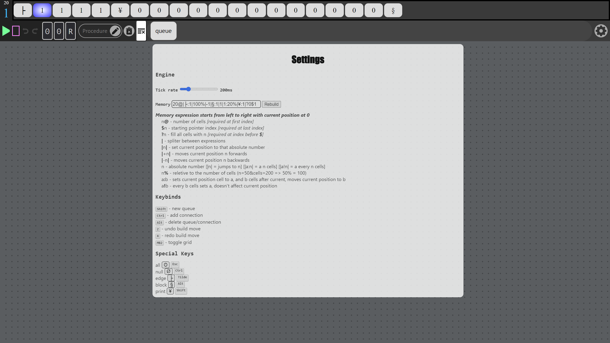

# Turing
### Basic turing machine implementation of core logic concepts with simple graphics.

#### Uses [P5.js](https://p5js.org) for graphics

  

## Getting Started - Basics
First create new queues and connect them to one another using a statement.

A statement has three properties:
* Left - matches to cell
* Middle - replace cell
* Right - move direction(forwards or backwards)

If the current memory cell matches the left statement:
* Jump to the connected end queue
* replace that memory cell with the middle statement
* move in memory on the direction of the right statement.

A collection of queues can be combined into a procedure to simplify chunks of logic and seperate them into their own machine (a procedure will behave exactly the same as how it was built, exiting when no actions are left(on queue with no matched statements)).

 

## Memory
### *Memory expression starts from left to right with current position at 0*
* n`@` - number of cells [required at first index]

* `$`n - starting pointer index [required at last index]

* `?`n - fill all cells with n [required at index before $]

* `|` - splitter between expressions

* `|n|` - set current position to that absolute number

* `|+n|` - moves current position n forwards

* `|-n|` - moves current position n backwards

* `n` - absolute number [|n| = jumps to n] [|a:n| = a n cells] [|* a!n| = a every n cells]

* n`%` - reletive to the number of cells (n=50&cells=200 => 50% = * 100)

* a`:`b - sets current position cell to a, and b cells after * current, moves current position to b

* a`!`b - every b cells sets a, doesn't affect current position

For example: *`10@|A:1|B:3|C!25%|?D$1`*

> This memory expression builds a memory with size of 10 cells, first cell is 'A', three cells after are 'B', every quarter(25%) cell is 'C', all other cells are filled as 'D', and the starting cell is the second (indexed 1).

 

## Keybinds
* <kbd>Shift</kbd> - new queue

* <kbd>Ctrl</kbd> - add connection

* <kbd>Alt</kbd> - delete queue/connection

* <kbd>Z</kbd> - undo build move

* <kbd>X</kbd> - redo build move

* <kbd>MB2</kbd> - toggle grid

 

## Special Keys
* all - `ʘ` <kbd>Esc</kbd>
* null - `Ø` <kbd>Ctrl</kbd>
* edge - `├` <kbd>Tilde</kbd>
* block - `§` <kbd>Alt</kbd>
* print - `¥` <kbd>Shift</kbd>

  

| Increment Base10 Using Plain Queues | Increment Base10 Using Procedures |
| --- | --- |
|  |  |

